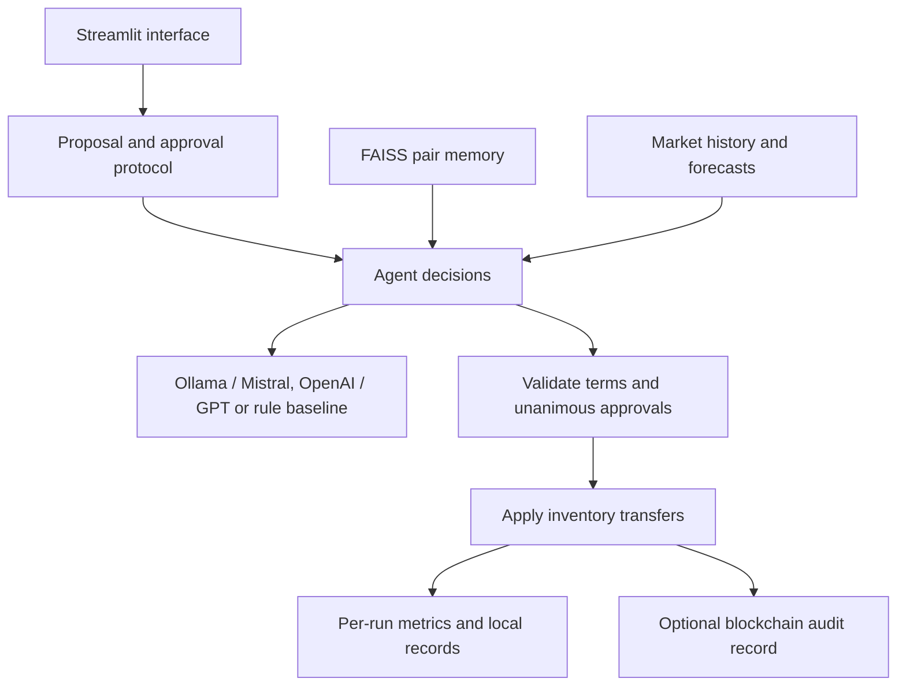

# Agentic AI Negotiation System

**A multi-agent service-barter prototype with explicit trade approvals, contextual memory, market forecasting, and blockchain audit records.**

Agents hold service inventories and outstanding needs. They evaluate bilateral exchanges and multilateral trade cycles, using either Mistral through Ollama or a deterministic baseline. A Streamlit interface displays proposals, outcomes, inventory changes, and evaluation metrics.

## What it demonstrates

- **Explicit negotiation:** every proposal has an ID and exact transfer quantities. Each participant must approve those terms before execution.
- **Multilateral exchanges:** directed-cycle detection identifies exchanges involving several agents, each with its own approval.
- **Contextual memory:** optional FAISS retrieval brings previous pair-specific outcomes into agent prompts.
- **Market signals:** optional Prophet forecasts influence proposed quantities and provide decision context.
- **Validated execution:** inventory, demand, quantities, and approvals are checked before any transfer is applied.
- **Audit records:** optional Solidity contracts store complete executed agreements, including all cycle transfers.
- **Evaluation:** per-run agreement rates, fulfilled demand, fairness, message counts, timing, and error reporting.

## Example

Three agents can satisfy each other's needs through a cycle:

```text
Agent A supplies data services and needs legal services.
Agent B supplies product services and needs data services.
Agent C supplies legal services and needs product services.

A ──data──▶ B ──product──▶ C ──legal──▶ A
```

The engine proposes exact quantities for the cycle. All three agents approve the same proposal before inventories change.

## Architecture



Agents appear in chat bubbles with readable offers and natural-language replies. Initial offers are engine-generated; bilateral agents can accept, reject, or submit structured counteroffers. Every counteroffer requires fresh approval from both participants. Free-form text never authorises a transfer.

## Quick start

Requires **Python 3.12**. The recorded validation environment is macOS arm64.

```bash
git clone https://github.com/abhishekmandloi95/Agentic_AI_Negotiation_System_Prototype.git
cd Agentic_AI_Negotiation_System_Prototype

python3.12 -m venv .venv
.venv/bin/python -m pip install -r requirements.txt
.venv/bin/python -m streamlit run ui_app.py
```

For the first run, select **Deterministic baseline** in the sidebar and leave RAG, Prophet, and Ganache disabled. This runs without a local model or blockchain.

For optional features:

```bash
.venv/bin/python -m pip install -r requirements-optional.txt
```

Start Ollama and install Mistral to use LLM decisions. Ganache is needed only when on-chain recording is enabled. See the [setup and usage guide](docs/USAGE.md) for commands, configuration, and feature behavior.

## Technology

| Component | Implementation |
|---|---|
| Interface | Streamlit |
| Negotiation and validation | Python |
| LLM decisions | Ollama / Mistral, structured JSON |
| Memory | Sentence Transformers and FAISS |
| Market forecasting | Prophet and pandas |
| Blockchain audit | Solidity and Web3.py |
| Testing | pytest, Streamlit AppTest, in-memory EVM |

## Experiments and validation

```bash
.venv/bin/python -m pip install -r requirements-dev.txt
make test
make benchmark
```

Experiments use paired seeds, fresh inventories, separate warm-up episodes, and saved per-run JSON. The deterministic baseline checks mechanics; it does not measure LLM quality.

The **8 September 2026** maintenance validation recorded **55 passing tests and 2 skipped live-service checks**. Passing checks included real embeddings, FAISS, Prophet, an in-memory blockchain round trip, and Streamlit reruns. Live Ollama and Ganache checks remain outstanding. See [maintenance and validation notes](MAINTENANCE.md) for scope and details.

## Project layout

```text
agents/         Agent state and decision clients
negotiation/    Proposals, approvals, transfers, cycles, and memory
market/         Market simulation and forecasting
blockchain/     Audit contracts and deployment helpers
metrics/        Per-run evaluation
experiments/    Benchmarks and feature comparisons
tests/          Regression and integration tests
utils/          Paths and local storage
data/           Agent profiles and local runtime data
ui_app.py       Streamlit application
```

## Scope and limitations

This is a research and learning prototype, not a production exchange.

- Utility measures fulfilled demand in resource units, not monetary profit.
- Agent approvals are simulated decisions, not wallet signatures. Contracts record agreements; they do not settle assets or enforce service delivery.
- Memory is session-local and bounded. Execution is sequential, and storage does not support multiple writer processes.
- No improvement from RAG, Prophet, or a particular agent personality is assumed. Those claims require controlled experiments.
- Historical charts predate the repairs and are retained for provenance; new results are written separately.

## Planned next phase

A separate rebuild is planned to explore FastAPI, LangGraph orchestration, durable retrieval, MCP tools, observability, and deployment. These are roadmap items, not current capabilities.

## Documentation

- [Setup, optional features, and experiments](docs/USAGE.md)
- [Maintenance changes and validation record](MAINTENANCE.md)
- [Source map](project_structure.txt)

The sidebar supports Ollama and OpenAI with editable model names. OpenAI requires an API key (masked session field or `OPENAI_API_KEY`). Provider/model changes reset the simulation. See [usage](docs/USAGE.md#switching-model-providers).

## Double-click startup on macOS

Double-click **Start App.command** in Finder. It starts Ollama, Ganache and Streamlit,
then opens the app in your browser. Keep its terminal open; Ctrl+C stops only services
started by that launcher. Existing healthy Ollama/Ganache services are reused. Each
launch opens a new Streamlit session on a free port.
Requires the project's .venv, Ollama, Node.js/npx and an installed Ollama model.
Ganache is downloaded by npx if needed. The existing ~/.ganache-negotiation database
is preserved. Logs are under ~/Library/Logs/AgenticNegotiation. Select Ganache recording
in the app when desired; starting the service does not enable recording automatically.
